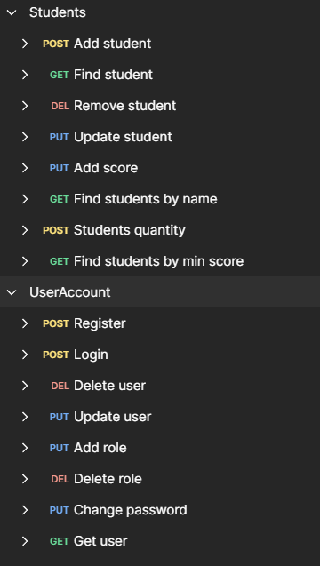

## В данной конфигурации используются следующие технологии:

Maven - система автоматизации сборки проекта

Spring Boot - фреймворк для разработки web-приложений на основе Spring

Spring Data MongoDB - модуль Spring для работы с MongoDB

Spring Web - модуль Spring для разработки web-приложений

Lombok - библиотека для уменьшения количества кода при работе с моделями данных

ModelMapper - библиотека для преобразования объектов моделей данных

Spring Test - модуль Spring для тестирования приложений

MongoDB - NoSQL документо-ориентированная база данных

## API

Апликация разработанна на базе следующих API

echo "# forum-service-j60" >> README.md

git init

git add README.md

git commit -m "first commit"

git branch -M main

git remote add origin https://github.com/AnatoliyVinokurov/forum-service-j60.git

git push -u origin main
